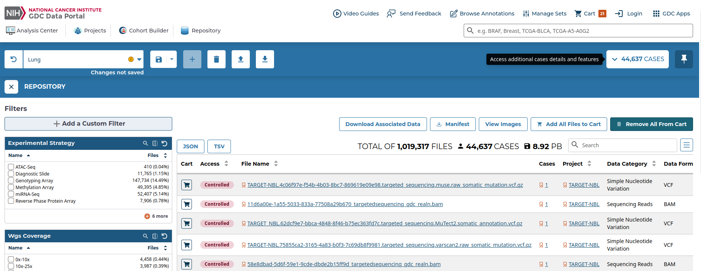
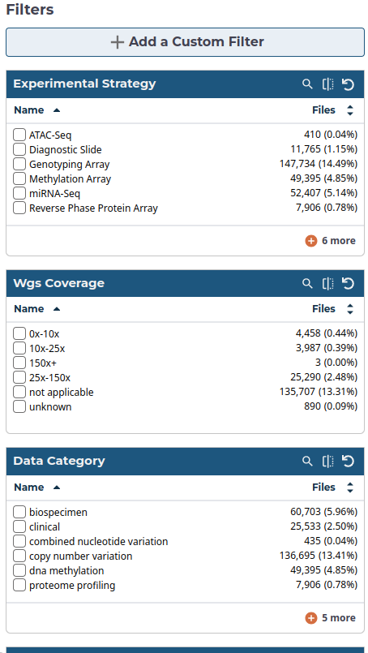
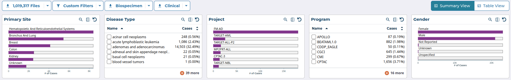
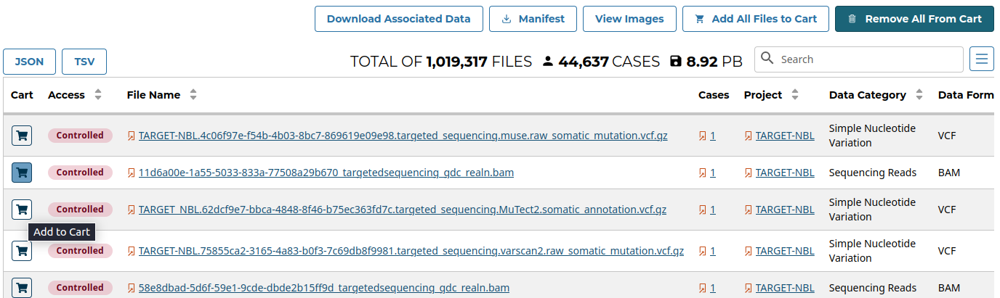
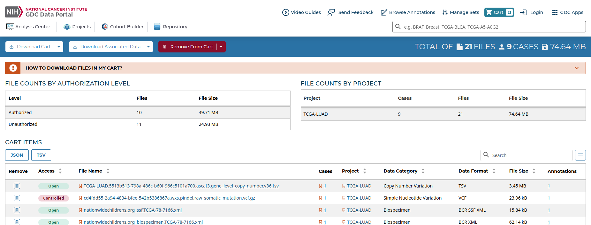
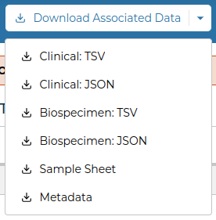
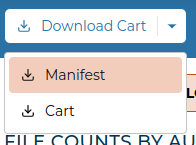
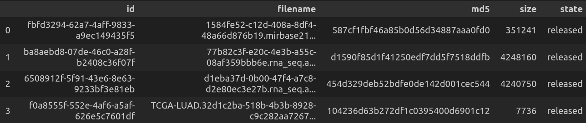
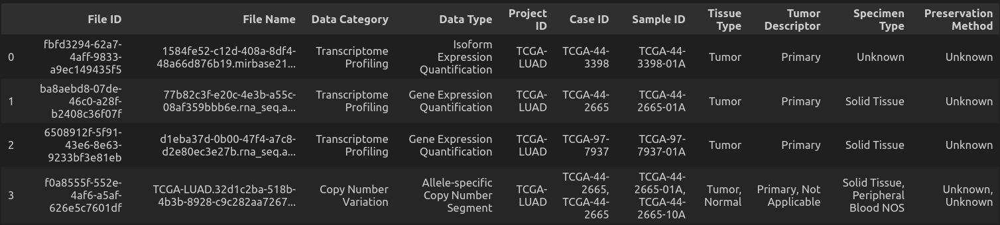

# Handling TCGA data

# --- Still under construction ---

## 1. Overall goals
- Work with TCGA data (e.g. of a specific study or primary site)
- Downoad data (or further data after a while)
- Download data matching specific cases from previous analyses

## 2. Your input
### 2.1. Prerequisites
- To use this script as a one-touch pipeline, you have to [create a conda environment](https://conda.io/projects/conda/en/latest/user-guide/getting-started.html) with the [Jupyter Notebook](https://anaconda.org/anaconda/jupyter) and the [pandas](https://anaconda.org/anaconda/pandas) package
- If you want to do the further analysis step with the [Snakemake](https://snakemake.readthedocs.io/en/stable/) pipeline, you will have to create a conda environment with the Snakemake and pandas package. You can also use the [given Snakemake environment file](envs/snakemake_env.txt) with this command to create a conda environment:

```
conda create --name Snakemake --file envs/snakemake_env.txt
```

### 2.2. Filter and select TCGA data
- Go to: [https://portal.gdc.cancer.gov/analysis_page](https://portal.gdc.cancer.gov/analysis_page)
- Click on "Repository"



- Filter by files:
    - Experimental strategy
    - Data type
    - Data format
    - Access
    - ...



- Filter by cases:
    - Primary site
    - Disease Type
    - Project
    - Gender
    - ...



- Select your files of interest or put all relevant data into the cart



- Click on the Cart symbol at the top to view the contents of the cart



- Click on "Download Associated Data". Download the following files:
    - Sample Sheet
    - Metadata
    - Optional: Clinical: TSV data for additional information



- Click on "Download Cart". Download the Manifest for a data download with the gdc-client tool



- Follow these steps every time for your new analyses, also when you have new aspects or file types to consider later on


### 2.3. File locations for manifests and sample sheets
- Create a local analysis folder and in this folder, a "sample_sheets" folder with sub-folders "clinical_data", "manifests", and "sample_sheets_prior"

&emsp;&emsp;&ensp;<analysis_path>

&emsp;&emsp;&ensp;└── sample_sheets
<br>
&emsp;&emsp;&emsp;&emsp;&ensp;├── clinical_data
<br>
&emsp;&emsp;&emsp;&emsp;&ensp;├── manifests
<br>
&emsp;&emsp;&emsp;&emsp;&ensp;└── sample_sheets_prior    


### 2.4. Optional: Download TCGA access token for restricted access files
- For restricted access files:
    - Login at TCGA (with NIH account) for restricted access files
    - Download access token, save as secured file


### 2.5. Adapt the configuration file
- The configuration file ["data/config.yaml"](data/config.yaml) encompasses all necessary information for a run of the pipeline to download TCGA data from a given manifest file and sample sheet.
- Information on how to fill out the configuration file are prepared within the [configuration file](data/config.yaml).

### 2.6. Start the pipeline
- If you have done all previous steps, you can activate your conda environment with the installed Jupyter Notebook package.
```
conda activate <name_of_environment>
```
- Then, open the Jupyter Notebook ["TCGA_steps_code.ipynb"](TCGA_steps_code.ipynb).
- You can either run the script cell by cell or everything at once.


## 3. Pipeline steps explained
### 3.1. Check validity of configuration file entries
- Checks whether all files listed in the configuration file are existent.

### 3.1. Combine manifest with sample sheet, filter for relevant files
- This is how a manifest file looks like:



- This is how a sample sheet looks like:



- Merges manifest and sample sheet
- If previous selection of case IDs wanted, the script filters for specific case IDs of previous analysis
- Creates adapted filtered manifest file for gdc-client download

### 3.2. Download TCGA data via a manifest document and the GDC-client tool
- The script creates a new conda environment called "gdc_client" and downloads the gdc-client tool. If you have already installed the gdc-client in a separete conda environment, you can specify that in the configuration file.
- The script downloads the TCGA data from manifest specified in previous steps and/or the configuration file via the gdc-client
- The files from the manifest are downloaded into the following folder: analysis_path + '00_raw_data'

- Optional: for restricted access files:
    - Login at NIH for restricted access files
    - Download access token, save as secured file
- Download gdc-client tool

```
gdc-client download -m manifest.txt -t user-token.txt
```

### 3.3. Rename the downloaded files as case_id.file_suffix
- As the filename consists of a suffix of 36 different characters as a unique id and is saved in a separate folder with another unique id of 36 characters, this script changes the suffix to the case id.
- take merged manifest and sample sheet
- rename downloaded files and put them in new folders for each analysis

### 3.4. Analyze files
- A Snakemake pipeline can be used to analyze all downloaded data 


